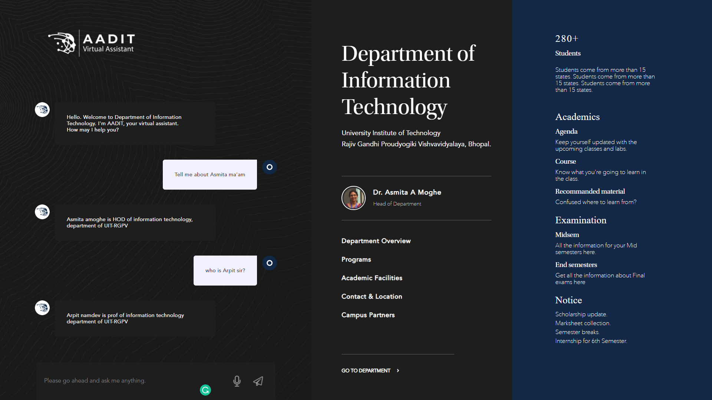

<h1 >  VIRTUAL ASSISTANT </h1>

## Setup and Installation :

#### Database setup
- https://www.postgresql.org/download/
- https://www.postgresql.org/download/
- create database named <Virtual_Assitance>
- py manage.py makemigrations
- py manage.py sqlmigrate Virtual_Assitance 0001 <latest file no in migrations>
- py manage.py migrate

#### Setup your virtual environemt

- pip install virtualenv
- python venv Minor-env || Nameofenvironment
- Minor-env\Scripts\activate

#### Activate virtual environement

- pip install requirements.txt

#### Install NLTK DATA
- download(nltk)

#### Start Server
- change directory to ADDIT PROJECT FILE
- python manage.py runserver

#### Server Details
- LOCALHOST - http://127.0.0.8/
- USERNAME - information
- PASSWORD - technology